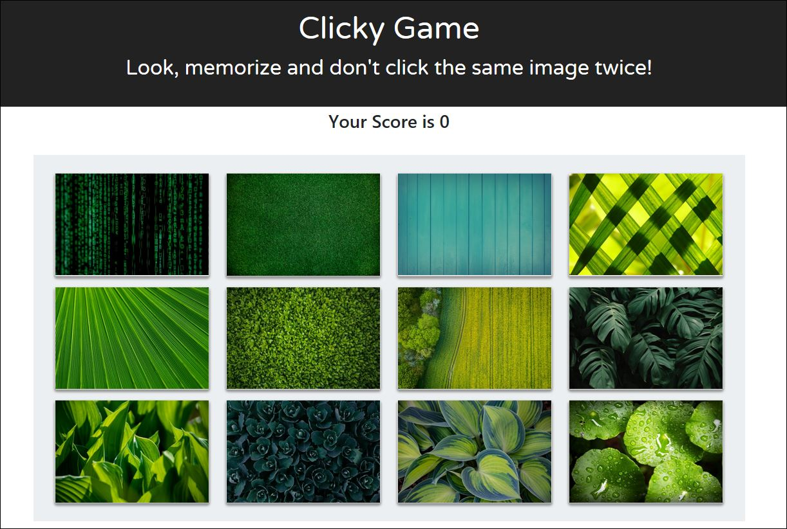

# Clicky-Game
How good is your memory?  Put it to the test with this clicky game!

## What is this?

This is a simple memorization and click game. The object of the game is to click on each of the 12 images ONCE.  If you click on the same image twice, then you lose and the score is reset to 0.  You win by correctly identifying each image and getting a total score of 12.

## How to Play:
- Install the game
- Click on an image
- The images will reshuffle to different positions
- Click on another image, but REMEMBER that you can only click on a character once.
- Keep going to see if you can get all 12.

## Screenshot:

## How to install and Run:
- Use `git clone` to copy
- Run `npm install` to get all dependencies
- `cd` into `clicky-game`
- Run `npm start`
- Go to `localhost:3000` in your web browser

## Built with:
- React
- Javascript
- HTML
- CSS